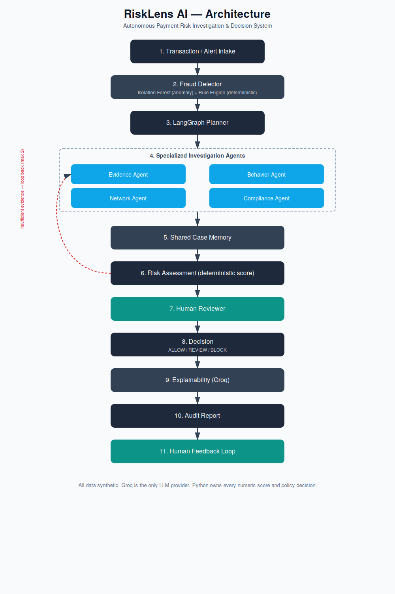

# RiskLens AI

**An AI agent that investigates suspicious payments before a human ever sees them.**
Built for the Razorpay AI Buildathon 2026 — AI Risk Manager track.

All data used is **synthetic**. No real Razorpay, customer, or payment data is used anywhere in this project.

**🔗 Live demo: [risklens-frontend-z0n3.onrender.com](https://risklens-frontend-z0n3.onrender.com)** — no install needed, click and explore.
> Runs on a free tier that sleeps after inactivity — if it looks blank for the first ~40 seconds, it's just waking up, not broken.

---

## The problem

Fraud detectors are good at flagging a transaction as "suspicious" — and bad at explaining *why*. A raw anomaly score gives a human analyst nothing to act on. They still have to manually dig through account history, device data, and transaction patterns before they can decide anything.

## The solution

RiskLens AI closes that gap. When a transaction is flagged, a team of AI agents investigates it automatically — gathering evidence, checking behavior patterns, checking network/device signals, checking compliance rules — and hands the analyst a complete case file with a score, a decision, and a plain-language explanation. Not a red dot. A full report.

**The core design decision:** the AI never invents the risk score. A transaction's score, its risk level, and the final Allow/Review/Block decision all come from plain, auditable Python — the same numbers every time, for the same evidence. The LLM's only job is to *explain* what the deterministic engine already decided. This means every decision this system makes can be traced back to a rule, not a guess.

## How it works

```
Transaction → Fraud Detector (Isolation Forest + rules)
   → AI Agents gather evidence (Behavior, Network, Compliance)
   → Deterministic Risk Engine scores it (0–100)
   → Not enough evidence? Loop back and investigate again (max 2 times)
   → Human reviews it if needed → Final decision (Allow / Review / Block)
   → AI explains the decision in plain language → Full audit trail saved
```



## Tech stack

| Layer | Choice |
|---|---|
| Frontend | React + Tailwind + Vite |
| Backend | FastAPI |
| Agent orchestration | LangGraph (real state graph with loops, not a scripted sequence) |
| LLM | Groq (only used for explanation — never for scoring) |
| Anomaly detection | scikit-learn Isolation Forest |
| Database | PostgreSQL + SQLAlchemy |
| Deployment | Docker + Docker Compose (one command, no manual setup) |

## Evaluation — real numbers, held out

The synthetic dataset has a ground-truth fraud label. The detector is trained only on a TRAIN split and tested only on a held-out TEST split it has never seen — this is the same discipline any real fraud model needs before it can be trusted.

**Result on a held-out test set of 421 transactions (8 of which were actually fraud):**

| Metric | Value |
|---|---|
| Precision | 0.50 |
| Recall | 0.50 |
| F1 score | 0.50 |
| False positive rate | 0.97% |
| Confusion matrix | 4 TP · 4 FP · 409 TN · 4 FN |

**Honest read:** fraud is a rare event in this dataset (~2% of transactions), so the held-out test set only contains 8 real fraud cases — too few to draw strong conclusions from, and the model catches half of them at 50% precision. This is a real, unpadded number from a small synthetic sample, not a production accuracy claim. What matters here is that the *evaluation methodology* is correct (proper train/test split, no leakage, real confusion matrix) — the number itself will move as the dataset and thresholds are tuned.

False-positive and false-negative costs (₹150 and ₹5,000 per case) are configurable assumptions for illustration, not real business figures.

## Run it locally (optional)

The live demo above needs nothing installed. If you want to run it yourself, you need **Docker Desktop** and a **Groq API key** (optional — see below).

```powershell
# 1. Copy .env.example to .env and paste your GROQ_API_KEY (or leave blank)
# 2. From the project root:
docker compose up --build
```

- Dashboard: **http://localhost:4173**
- API docs: **http://localhost:8000/docs**

The app seeds itself with demo transactions on first run — the dashboard is never empty.

**No Groq key?** The system automatically falls back to a clearly-labelled offline explanation mode. Every other part — detection, investigation, scoring, decisions, audit — works fully without any API key. If Groq goes down mid-investigation, the same fallback kicks in instead of crashing.

## Try the demo

1. Open the dashboard — see flagged transactions.
2. Click **Investigate** on any alert and watch the agent pipeline run live.
3. Submit a human review if the risk is Medium/High.
4. Check **Evaluation** for the metrics above, and **Audit** for the full trail behind any decision.

## Tests

```powershell
cd backend
pip install -r requirements.txt
pytest -v
```

22 tests, covering data generation, the fraud detector, the risk engine, the LangGraph state machine (including the investigation loop), the full API flow, and evaluation.

## What this isn't

This is a buildathon prototype on synthetic data — not a production fraud system, not connected to real Razorpay data, and not regulator-approved. The evaluation numbers above are real but come from a small synthetic sample and shouldn't be read as production accuracy.
